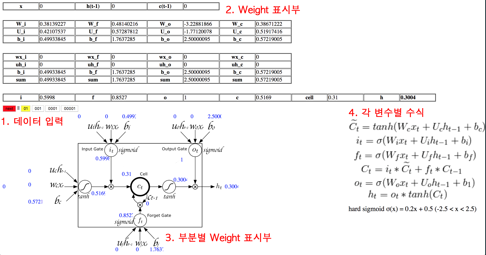

# LSTM Weight Visualization

### 개요
간단한 시계열 데이터를 입력하여 LSTM 동작 원리를 확인할 수 있는 프로그램

### 내용
- 1개의 LSTM Node를 가진 LSTM 모델을 구성함.
- 0과 1이 반복되는 간단한 시계열 데이터(01,001,0001,0001)를 입력하여, 모델을 학습시킴.
- 학습이 된 모델의 Weight 값을 추출하여, LSTM 노드의 각 부분의 Weight Visualization을 함.
-  Next 버튼을 누르면서 데이터가 입력됨에 따라 LSTM의 각 부분이 어떻게 변하는 지 확인을  할 수 있음

### 실행

`index.html` 파일을 웹브라우저에서 열기

### 사용법

#####1. 데이터 입력

버튼을 눌러 입력 데이터를 선택할 수 있음.

버튼           | 입력 데이터
------------- | -------------
01            | 01010101010101010101...
001           | 00100100100100100100...
0001          | 00010001000100010001...
00001         | 00001000010000100001...

NEXT를 누르면 선택한 데이터가 순차적으로 입력이 되면서 LSTM node Weight의 변화를 확인할 수 있음.

##### 2. Weight 표시부

현재 상태의 전체 Weight 값을 확인할 수 있음.

##### 3. 부분별 Weight 표시부

LSTM Node 상에서 Weight 값을 확인할 수 있음

##### 4. 각 변수별 수식

각 변수별 수식을 확인할 수 있음.